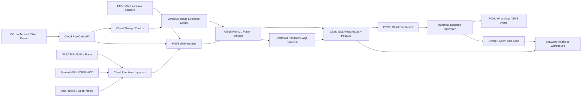

# VayuLens Architecture

## System Diagram



## Data Contracts

### Citizen Report

```json
{
  "report_id": "rpt_1029",
  "user_id_hash": "u_7a91",
  "lat": 28.626,
  "lon": 77.312,
  "timestamp": "2026-07-07T14:10:00+05:30",
  "media_uri": "gs://plumegraph-reports/rpt_1029.jpg",
  "language": "hi",
  "note": "कूड़े के ढेर से धुआं आ रहा है",
  "offline_queued": false
}
```

### Image Evidence

```json
{
  "report_id": "rpt_1029",
  "smoke_probability": 0.91,
  "dust_probability": 0.18,
  "garbage_fire_probability": 0.84,
  "visual_haze_score": 0.67,
  "exif_confidence": 0.94,
  "duplicate_risk": 0.03,
  "privacy_blurred": true
}
```

### Sensor Reading

```json
{
  "sensor_id": "pms_042",
  "lat": 28.624,
  "lon": 77.306,
  "timestamp": "2026-07-07T14:18:00+05:30",
  "raw_pm25": 236,
  "corrected_pm25": 212,
  "raw_pm10": 410,
  "humidity": 64,
  "device_health": "ok"
}
```

### Hotspot Cell

```json
{
  "cell_id": "ward42_074",
  "state": "CONFIRMED",
  "confidence": 0.96,
  "cause": "garbage_dump_fire",
  "current_pm25": 212,
  "forecast_peak_aqi": 247,
  "spike_window": "19:00-21:00",
  "exposed_population": 8400,
  "recommended_action": "mist_cannon_plus_solid_waste_crew"
}
```

## Fusion Logic

```text
hotspot_score =
  0.30 * sensor_anomaly_z
+ 0.20 * visual_smoke_haze_score
+ 0.15 * citizen_trust_score
+ 0.15 * wind_upstream_source_score
+ 0.10 * FIRMS_fire_prior
+ 0.05 * satellite_aod_no2_prior
+ 0.05 * vulnerable_population_score
```

## Hotspot State Machine

```text
Clear
  |
  | one citizen photo OR weak sensor anomaly OR satellite/fire prior
  v
Watch
  |
  | two independent reports OR trusted report + sensor anomaly
  v
Suspected
  |
  | two independent source families + wind/geospatial plausibility
  v
Confirmed
  |
  | dispatch completed + post-intervention PM/haze improvement
  v
Mitigated
```

## Deployment Modes

### Hackathon Demo

```text
GitHub Actions -> GitHub Pages -> static prototype
```

### City Pilot

```text
Cloud Run + Cloud SQL/PostGIS + Pub/Sub + Cloud Storage + Vertex AI
```

### Full ICCC Deployment

```text
ICCC dashboard embed + municipal asset APIs + FCM/SMS/WhatsApp alert routing + BigQuery impact reporting
```
